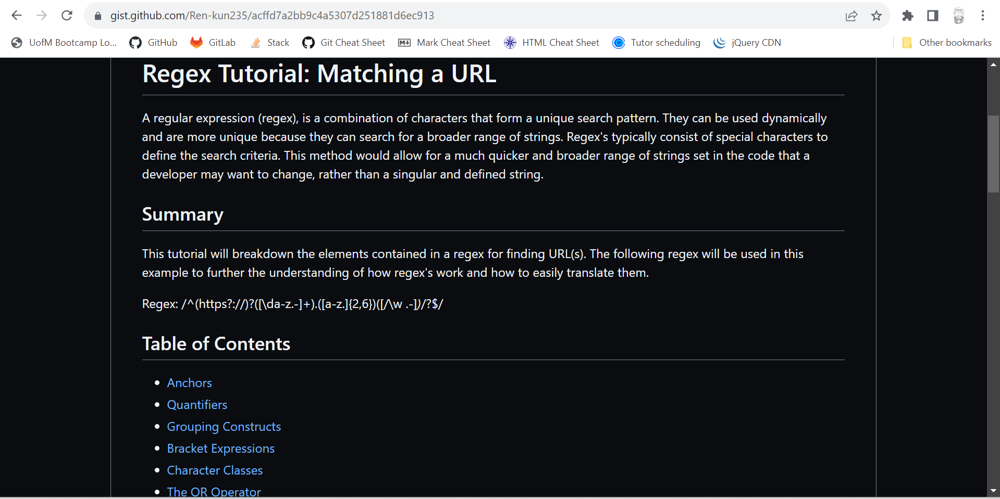

# regextutorial

The breakdown of a regular expression and what the different parts are.

## Description

The purpose of this tutorial is to educate aspiring developers on how to read, write, and apply regular expressions (regex's).

## Usage

Upon opening the tutorial, You can find a multitude of sections that will inform you of the many parts of regular expressions.

## Credit

N/A

## License

N/A
